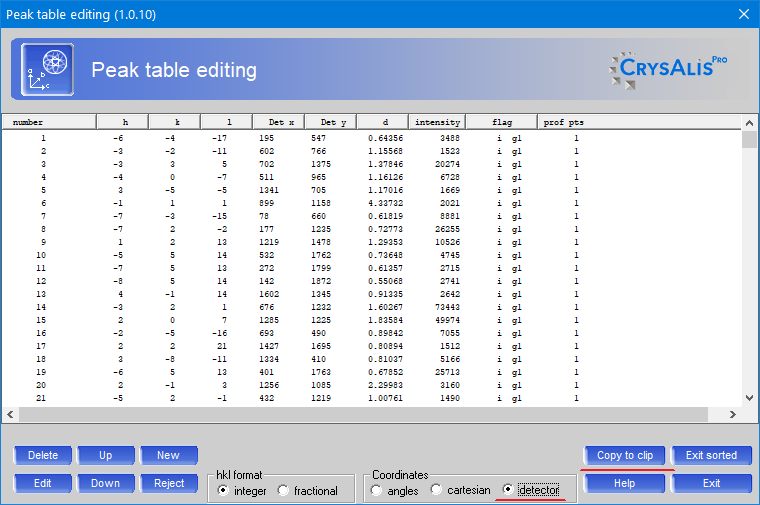
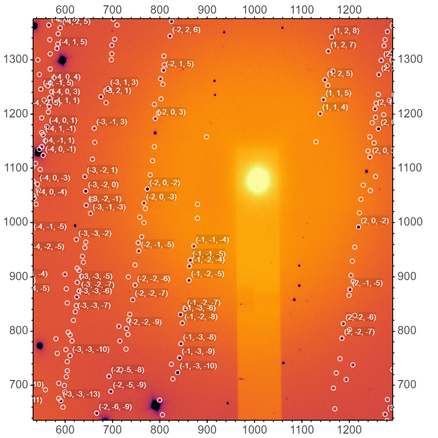

# Crysalis-PEAKS2IMAGE
Jupyter notebook working in a tandem with [Crysalis](https://www.rigaku.com/de/products/smc/crysalis) - software used for single crystal data processing.
Can be used for single crystal data obtained at conventional and high pressure experiments.

Files are uploaded into the notebook using an upload button. The code displays information
regarding lattice parameters, volume for constrained and unconstraned unit cell, orientation matrix.

## Operation
The notebook works under windows. It can be simplified to the procedure:
- Start with the [Jupyter-Notebook](./Crysalis_PEAKS2IMAGE.ipynb "Notebook")
- Load a .tif file ([fabio library](https://github.com/silx-kit/fabio "fabio library at github"))
- Adjust the presentation (palette, etc)
- Open the Crysalis session
    - Open peak table **pt e** command of Crysalis
    - Adjust the peaks as integrated as you see fit. It would be advised to show the peaks which are presented on an oscillation image.
      Cleaning/Filtering of the peaks is advisable
    - Select **Coordinates->detector** radio button as indicated in the dialog window below
    - Push **Copy to clip** button
- Switch back to the Jupyter-Notebook
- Press **Clipboard polling->ON** 
- The data should be loaded

Since the Windows system clipboard is accessed via pywin32 module, it is suggested to avoid keeping clipboard polling for a long time.

## Installation
### Newer installation under python virtual environment
Added a [requirements file](requirements.txt) for pip installation with python 3.11.9.
It can be adjusted to work with miniconda.

Additionally, please check the instructions for generation of jupyter configuration file described in a section below. 

### Older instruction for installation with Anaconda
Installation under [Anaconda](https://anaconda.org/ "Anaconda Site"):

    conda install bokeh numpy pywin32 --yes
    conda install -c conda-forge fabio ipywidgets --yes

    # Jupyter Notebook
    jupyter nbextension enable --py widgetsnbextension

    # JupyterLab 1/2
    conda install -c conda-forge nodejs --yes
    jupyter labextension install @jupyter-widgets/jupyterlab-manager
    
    #JupyterLab 3
    conda install -n base -c conda-forge jupyterlab_widgets

### Important steps for uploading files into Jupyter using ipywidgets
There are some steps which are required for additional configuration of Jupyter. These steps enable upload of larger files.
I found the original discussion [here](https://github.com/jupyter-widgets/ipywidgets/issues/2522).

    # under conda base or specific environment run
    jupyter notebook --generate-config
    
    # under windows this will generate a config file in:
    %userprofile%\.jupyter\jupyter_notebook_config.py

    # open this file with your favorite editor
    notepad++ %userprofile%\.jupyter\jupyter_notebook_config.py

Then uncomment the parameters string:
    
    # c.NotebookApp.tornado_settings = {}

Finally change the parameter string to:

    c.NotebookApp.tornado_settings = {"websocket_max_message_size": 100 * 1024 * 1024}

Saving the Jupyter configuration file will finish the job.

I suggest restarting Jupyter lab after installation of all packages as well after the change of the configuration file.
If something does not work - let me know.

## Example
